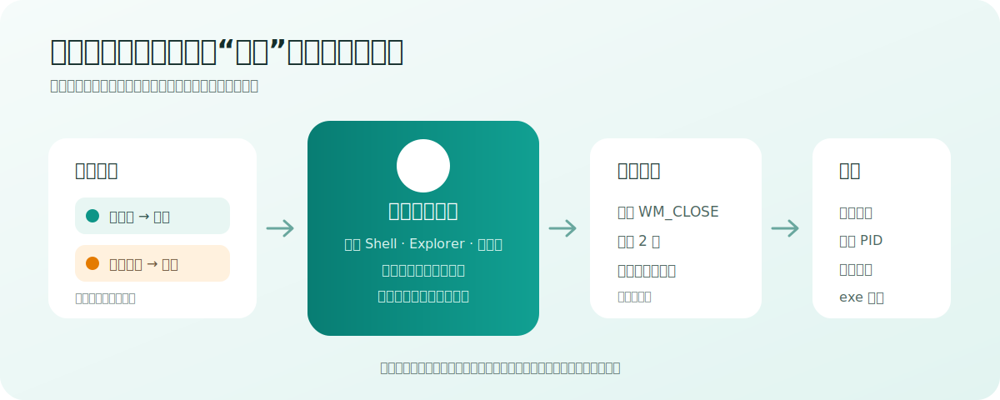

# Windows 应用清理器

> 面向 Windows 10/11 的轻量桌面整理工具：用悬浮球快速关闭任务栏应用或退出通知区域应用，并保留白名单与安全确认。




## 项目定位

这个工具不是通用任务管理器，也不会把所有后台进程一键杀掉。它只处理用户能够明确理解的桌面应用：

- **前台**：在 Windows 任务栏中拥有可见主窗口的应用。
- **后台**：在 Windows 通知区域中显示图标，并且能够可靠映射到正在运行 exe 的应用。

同一个应用同时拥有任务栏窗口和通知区域图标时，会显示为相邻两行。白名单按进程名作用于整个应用，因此两行的图钉状态同步。

## 使用体验

- 启动后默认只显示约 80×80 的透明悬浮球。
- 点击悬浮球展开紧凑面板；点击其他位置后面板立即收起。
- 面板根据当前显示器可用空间选择展开方向，不越过工作区。
- 列表按前台优先、后台其次排序，超过最大高度后滚动。
- 每行提供单项清理和白名单图钉，底部提供“清理前台”和“退出后台”。
- 全屏游戏或视频出现时可以自动隐藏悬浮球。
- 支持系统托盘、全局快捷键、开机启动和多显示器 Per-Monitor DPI V2。

## 清理语义

### 清理前台

只向目标任务栏窗口发送 `WM_CLOSE`。窗口消失即视为成功；应用自行退到通知区域不算残留，也不会继续追杀进程。

### 退出后台

后台语义是退出拥有通知区域图标的整个应用，因此会向该应用本次快照中的全部顶层窗口发送正常关闭请求。若它同时有前台窗口，这些窗口也会一起关闭。

### 强制结束

正常关闭后等待两秒。仍未达到成功条件的应用进入汇总确认；只有用户明确同意后才会强制结束。执行前重新校验清理开始时捕获的 PID、启动时间和 exe 路径，禁止按进程名批量杀进程。

## 不会做什么

- 不扫描普通无窗口后台服务。
- 不强退桌面、任务栏、系统 Shell、安全进程或本工具自身。
- 不把身份不明的通知图标映射成可清理应用。
- 不自动点击应用自己的“是否保存”对话框。
- 不在主程序中长期持有管理员权限。

`explorer.exe` 只允许关闭具体文件窗口，永远不强退整个 Windows Shell。

## 安装与运行

### 从源码运行

需要 Windows 10 19041+ 和 .NET 10 SDK：

```powershell
git clone https://github.com/ddbbiii/windows-app-cleaner.git
cd windows-app-cleaner
dotnet run --project .\src\WindowsAppCleaner\WindowsAppCleaner.csproj -c Debug
```

### 生成自包含版本

```powershell
dotnet publish .\src\WindowsAppCleaner\WindowsAppCleaner.csproj `
  -c Release -r win-x64 --self-contained true `
  -p:PublishTrimmed=false -o .\artifacts\publish
```

## 配置

安装版配置位于 `%LocalAppData%\WindowsAppCleaner\config.json`。便携版目录存在 `portable.flag` 时，配置保存在程序目录。

| 字段 | 用途 |
| --- | --- |
| `hotkey` | 全局清理快捷键，支持 F4 等单键 |
| `allowlist_process_names` | 按进程名匹配的长期白名单 |
| `autostart_enabled` | 当前用户开机启动 |
| `minimize_to_tray_on_launch` | 启动后保持收起 |
| `cleanup_mode` | 默认清理范围 |
| `floating_position` | 悬浮球位置 |
| `hide_in_fullscreen` | 全屏时隐藏 |

配置使用临时文件和原子替换写入。首次启动可迁移旧版 `config.json` 和指向 `pythonw.exe + main.py` 的启动项。

## 技术架构

项目采用 `C# / .NET 10 / WPF` 单进程架构：

- `AppInventoryService` 合并任务栏窗口和通知区域来源。
- WinEventHook 监听窗口变化并进行防抖刷新。
- DWM cloaked、owner、tool-window 和 app-window 关系用于任务栏窗口分类。
- 通知区域条目来自已显示图标设置与正在运行路径的交叉确认。
- 悬浮球和展开面板使用两个独立窗口，减少跨屏 DPI 漂移和展开闪烁。
- 单实例互斥锁保证第二次启动只唤醒现有实例。

## 开发验证

```powershell
dotnet test .\WindowsAppCleaner.slnx -c Release
dotnet build .\WindowsAppCleaner.slnx -c Release
```

重点人工测试应覆盖 100%/175% 缩放双屏、跨屏拖动、四边展开、全屏隐藏、F4、通知区域双状态应用、未保存文档和管理员权限应用。

## 已知边界

Windows 没有公开、稳定的 API 可以完整枚举其他应用的通知区域图标。当前实现只把系统记录为已显示、并能与运行中 exe 精确匹配的条目归为后台；漏掉一个后台应用优于错误关闭身份不明的进程。

推送 `v*` 标签后，GitHub Actions 会生成自包含便携 ZIP、Inno Setup 用户级安装包和 SHA256。发布物目前未签名，Windows SmartScreen 可能显示提示。

## License

当前仓库尚未添加开源许可证。在许可证确定前，源码可以公开查看，但不自动授予复制、修改或分发权利。
